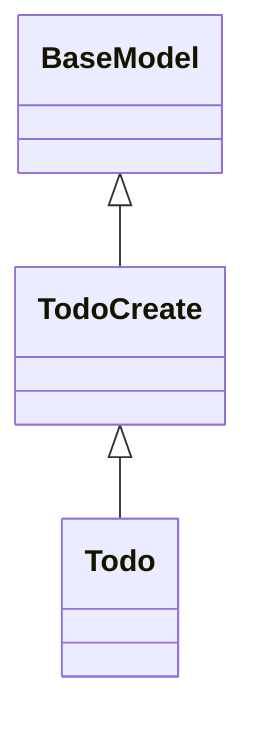

## Todo REST Service
````markdown
## Todo REST Service

A RESTful web service using FastAPI.
The service handles HTTP GET, POST, UPDATE, DELETE, and OPTIONS
methods for a "/todo" endpoint.

### Code Organization

| File                 | Contents           |
|:---------------------|:-------------------|
| `models.py`          | Classes for Todo and TodoCreate. Used for serialization and input validation. |
| `persistence.py`     | `TodoDao` class provides persistence for Todo objects. |
| `main.py`            | FastAPI code to run the application. |

## How to Build and Run

1. Install required packages in a virtual env.
   You can also create a venv in VS Code, which may be easier.
   ```shell
   $ python -m venv env
   # Activate the venv. This is for Linux & MacOS.  
   . env/bin/activate
   (env)$ pip install -r requirements.txt
   ```

2. Run the app using uvicorn:
   ```shell
   (env)$ uvicorn main:app --reload
   ```

3. Navigate to <http://127.0.0.1:8000/docs>. (Sorry, no html UI yet.)

   - You should see OpenAPI style documentation of the endpoints.
   - Click the "try it" button to input values and submit a request.

4. Stop the application by pressing CTRL-C or close the window.

## Class Diagram

The class hierarchy for the Pydantic models is:



## Build Docker 'todo' Image using Dockerfile

> This is for development.  For production builds, 
> use `docker-compose` to build and run everything.

1.  Build image: `docker build -t "todo:$VERSION" .` where `VERSION=0.1`, or whatever.
2.  Verify it: `docker images` should list the image.

## Run Docker 'todo' Image using 'docker' command

> This is for development.

The docker container needs 2 things:
- Expose port 8000 (uvicorn listening port) to a host port (say) 80 using `-p 80:8000`
- Mount a directory of todo data (`./data`) onto container's `/app/data`: `-v`
- You must specify a relative or absolute **path** to `./data` and not simply write `data`, which Docker will interpret as a *named volume* (storage managed by Docker)

Run in foreground on port 80.  Name the container "todo".
If there is already a container named todo, remove it using `docker rm todo`.

```shell
docker run -p 80:8000 -v ./data:/app/data --name todo todo:$VERSION
```
To run in background ("detached mode") add `-d` flag to the command.

Open an interactive terminal in the running container:

```shell
docker exec -it todo /bin/bash
```

List running containers: `docker ps`

Stop the container. 

- if running in foreground: CTRL-C
- if running in detached mode: `docker stop todo` 
- or `docker stop 2bc8a5` using a prefix (2bc8a5) of the container id shown by `docker ps`
